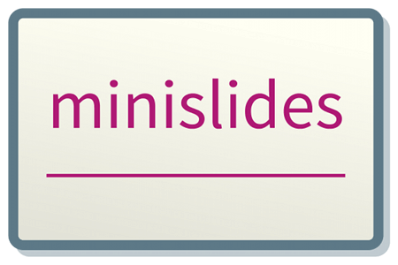

# minislides    

**The minimal HTML slide presentation framework**

With only <span class="js">650</em> bytes of JavaScript, <span class="css">371</span> bytes of CSS, and a few lines of HTML, it offers

* Fully responsive design
* keyboard navigation by arrow keys, space bar, PageUp, PageDown, Home, End.
  Bonus: Esc hides the presentation
* URL-fragments (i.e. slide number in location hash)
* Smooth transition between slides
* Incremental slide content (e.g. bullet lists)
* Support for direct styling, i.e. you can use a data-attribute on a slide to style the body when that slide becomes active
* shrink-to-fit images
* *No* global namespace pollution, i.e. no global variables and no `on*` attributes
* Valid, semantic HTML markup
* No FOUC

No plugins, no dependencies, no bullshit. Just minislides.

## Demo

See [thomasr.github.io/minislides](http://thomasr.github.io/minislides/) for exemplary use. 

## Compatibility

 |  |  | 
:-: | :-: | :-: | :-:
 ✔ |  ✔ | ✔ | ✔ 

## Usage

Download [minislides.html](dist/minislides.html) and start editing. There are comments there that will guide you. No need to download any additional files. JS and CSS is included.

## The code

### [JS](dist/minislides.min.js)
```javascript
((m,I,n,i,S,l,y,d,e,s,_,R,O,C,K)=>{d=l.body,s=Array.from(l[i+"All"]("section")),K=$=>{_=Math.min(s.length,$||1),R=s[_-1],s.map.call(R[i+"All"](m),a=>a[I].remove(S)),y.hash=_,d.style.background=R[n].bg||"",d[n].slideId=R[n].id||_},addEventListener("keydown",(g,o)=>{C=g.which-32,C&&C-2&&C-7&&C-8||(O=R[i](m+`:not(.${S})`),O?O[I].add(S):K(_+1),o=1),C-1&&C-5&&C-6||(K(_-1),o=1),C+5||(d[I].toggle("muted"),o=1),C-4||(K(1),o=1),C-3||(K(1/0),o=1),o&&g.preventDefault()}),s.map((a,t)=>a.id=t+1),e=a=>{a=y.hash.substr(1),a!=_&&K(a)},e(),d[I].add("loaded"),setInterval(e,99)})(".incremental","classList","dataset","querySelector","revealed",document,location)
```

### [CSS](dist/minislides.min.css)
```css
body,html{overflow:hidden;font-size:4vw;width:100%;height:100%;margin:0;padding:0}body.loaded{transition:.3s}body.loaded section{transition:opacity .5s}section{position:fixed;top:1vw;bottom:1vw;left:1vw;right:1vw;opacity:0}section:target{z-index:1}body:not(.muted) section:target{opacity:1}img{max-height:100%;max-width:100%}.incremental:not(.revealed){visibility:hidden}
```

## Why?

I don’t know. It must have something to do with [code golf](https://en.wikipedia.org/wiki/Code_golf) and with me being slightly crazy.

[](LICENSE)
